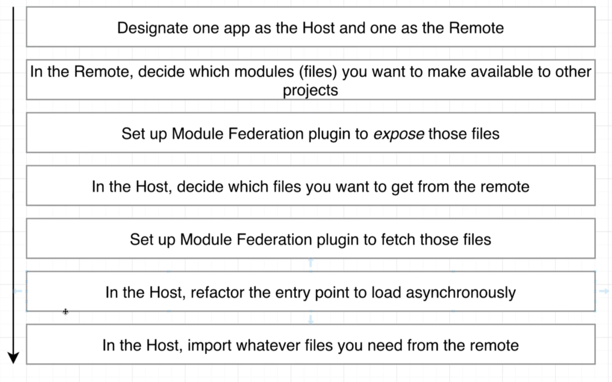
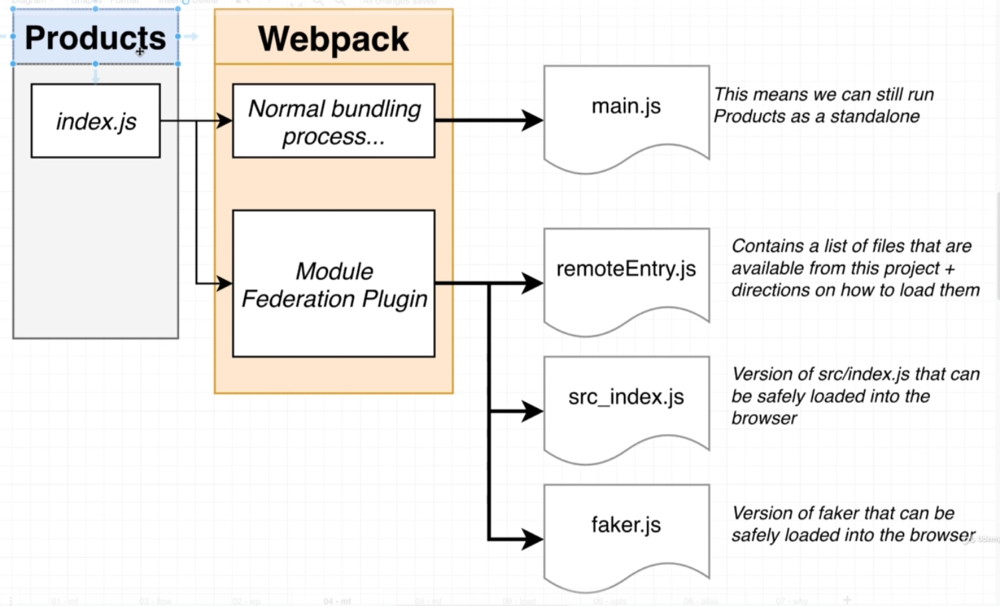
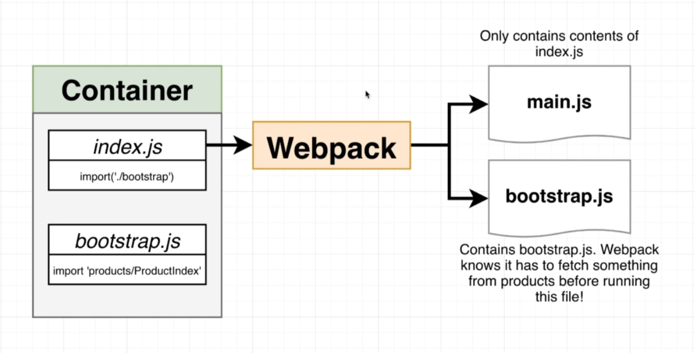
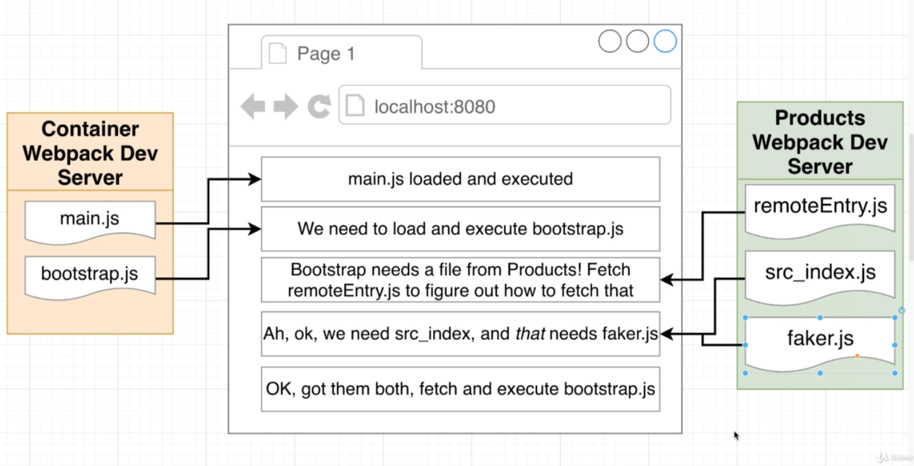
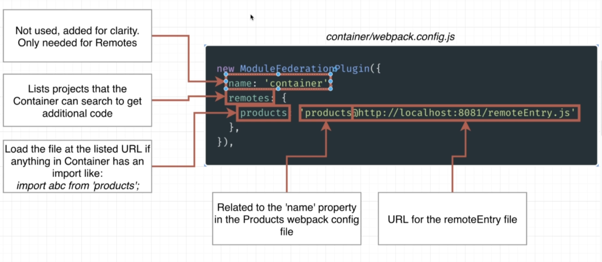
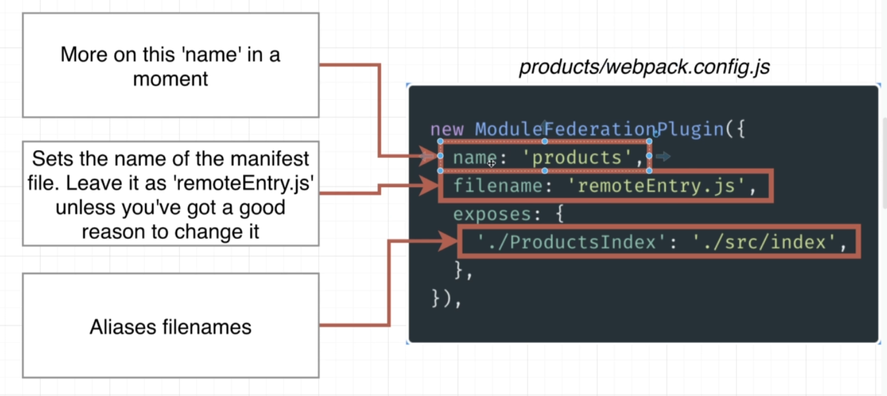
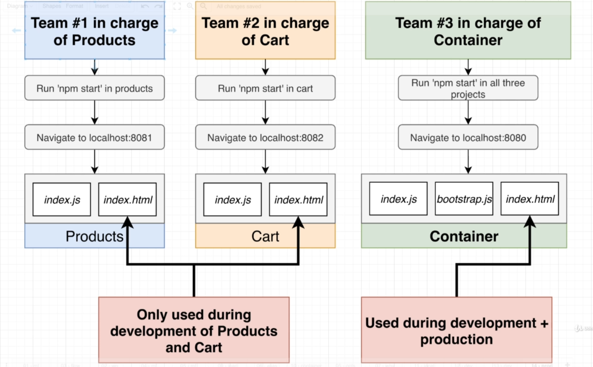
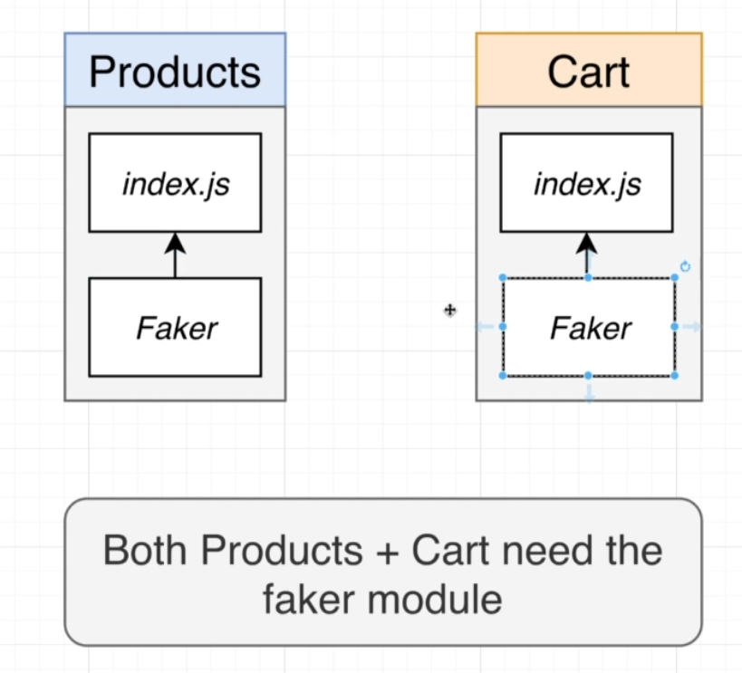

# Module Federation Plugin

Ở Products chúng ta có đoạn config sau:

```javascript
new ModuleFederationPlugin({
  name: "products",
  filename: "remoteEntry.js",
  exposes: {
    "./ProductsIndex": "./src/index",
  },
});
```

Nó nói rằng tạo ra một app là products có file chỉ ra các file js cần load có tên là remoteEntry.js (giống như một người hướng dẫn).

Ở trong Container chúng ta config webpack để chỉ cho nó ở đây để load products:

```javascript
new ModuleFederationPlugin({
  name: "container",
  remotes: {
    products: "products@http://localhost:8081/remoteEntry.js",
  },
});
```

Tiếp đến chúng ta refactor lại file ở container và import module cần thiết vào file script chính.


Hướng dẫn các bước

Mục đích khi load các file

Flow



Process


Cả 2 cùng xài chung package nên chúng nên tìm cách shared package với nhau

